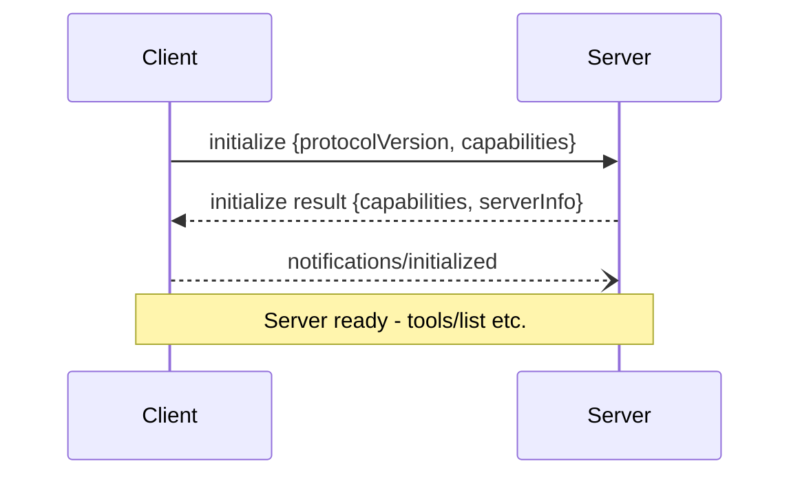

# MCP BigQuery Server – Development Requirements & Specifications (v1.0‑draft, MCP rev 2025‑03‑26)

## 0. Purpose
This document defines a **fully‑compliant Model Context Protocol (MCP) server** that surfaces Google BigQuery functionality to LLM agents and other MCP clients.  It has been rewritten to align with the **MCP specification rev 2025‑03‑26**  and its companion concept docs for lifecycle, transports, tools, resources, pagination, and logging .

---

## 1. Protocol Compliance Snapshot
| Area | Compliance Summary |
|------|--------------------|
| **Lifecycle** | Implements `initialize` → `initialized` handshake exactly as specified; negotiates `tools` (+ `logging` optional) capabilities. |
| **Transports** | Primary: **stdio**; Optional: **Streamable HTTP** with SSE streaming.  Follows all security guidance (Origin validation; localhost bind by default). |
| **Message Types** | Pure JSON‑RPC 2.0.  The server never emits custom top‑level methods for business ops; all BigQuery actions are exposed **only through MCP Tools** (`tools/list`, `tools/call`). |
| **Pagination** | Long result sets (datasets, rows) use `nextCursor` pattern. |
| **Logging Utility** | Optional `logging/log` notifications & `logging/setLevel` request supported . |
| **Timeouts & Errors** | Honors MCP timeout semantics and returns standard JSON‑RPC codes (−32000..‑32099 for BigQuery errors). |

---

## 2. Capabilities Advertised (`initialize` response)
```json
{
  "protocolVersion": "2025-03-26",
  "capabilities": {
    "tools": {
      "listChanged": true
    },
    "logging": {}
  },
  "serverInfo": {
    "name": "mcp-bigquery-server",
    "version": "1.0.0"
  }
}
```

---

## 3. Tool Surface
All BigQuery operations are defined as **Tools**.  Below is the canonical list returned by `tools/list` (schemas abbreviated):

| Tool `name` | Description | `inputSchema` (major fields) | Annotations |
|-------------|-------------|------------------------------|-------------|
| `execute_query` | Submit a SQL query to BigQuery, optionally as **dry‑run** | `projectId?`, `location?`, `sql`, `params?`, `dryRun?` | `{readOnlyHint:true, openWorldHint:true}` |
| `get_job_status` | Poll job execution state | `jobId` | `{readOnlyHint:true}` |
| `cancel_job` | Cancel a running BigQuery job | `jobId` | `{destructiveHint:true, idempotentHint:true}` |
| `fetch_results_chunk` | Page through results | `jobId`, `offset`, `maxRows` | `{readOnlyHint:true}` |
| `list_datasets` | Enumerate datasets visible to the service account | `projectId?`, `cursor?` | `{readOnlyHint:true}` |
| `get_table_schema` | Retrieve schema for a table | `projectId`, `datasetId`, `tableId` | `{readOnlyHint:true}` |

### Tool Result Contract
Each `tools/call` response uses the **Tool Result** envelope .  For row data the server returns **embedded resources** (`type:"resource"`) pointing at a temporary resource URI so that clients can lazily `resources/read` large payloads.

---

## 4. Resources (Optional)
If enabled via `--expose-resources`, the server advertises:
* Dataset & table schemas as read‑only resources (`bq://\<project\>/\<dataset\>/schema`).
* Query result sets (chunk URIs).
These appear in `resources/list` and honour pagination rules .

---

## 5. Transports
### 5.1 stdio (default)
* One JSON‑RPC message per line (UTF‑8, no embedded newlines) .
* Server uses `stderr` for human‑readable logs; never writes non‑MCP data to `stdout`.

### 5.2 Streamable HTTP (`--http`)
* Single endpoint `/mcp` supporting POST + GET.
* POST returns SSE (`text/event-stream`) for streaming responses when the client advertises `Accept: text/event-stream`.  Otherwise returns single JSON object .
* Security: verifies `Origin`, optional basic‑auth token.

---

## 6. Error Handling
| Code | Scenario | Notes |
|------|----------|-------|
| `-32601` | Unknown method (should never occur; only `initialize`, `tools/*`, etc.) | │
| `-32602` | Invalid params / schema validation failed | │
| `-32000` | Generic BigQuery API error (wrapped) | `error.data` mirrors BQ error structure |
| `-32001` | Query timeout (`<queryTimeoutMs>`) | │

Errors inside tool execution use the **Tool Execution Error** pattern with `isError:true` .

---

## 7. Non‑Functional Requirements
_Remain unchanged from previous draft except:_
* Added **95th percentile latency target ≤ 800 ms** for queries <10 MB.
* Pagination **MUST** be implemented for `list_datasets` (uses `nextCursor` per spec) .

---

## 8. Lifecycle Sequence (Detailed)

_Complies with spec diagram_ .

---

## 9. Security Checklist
* Follows Origin‑check & localhost binding advice for HTTP transport .
* Service‑account key loaded from env var; never sent over MCP.
* Validates every `tools/call` args against JSON Schema before touching BigQuery.
* Implements per‑client token‑bucket rate limiting.

---

## 10. Open Questions / Next Steps
1. **Sampling capability** – currently out of scope; consider in v1.1.
2. **Resource subscriptions** for long‑running result sets.
3. **Agent graph integration** once spec lands (roadmap Q3 2025).

---

*End of spec – fully aligned with MCP rev 2025‑03‑26.*

